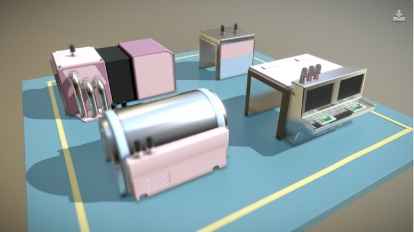

# PICA PICA Assets

This repository hosts some of the assets used during the creation of _Project PICA PICA_.

You may also find these objects on [SketchFab](https://sketchfab.com/SEED.EA).

## PICA PICA

PICA PICA is a real-time ray tracing experiment featuring self-learning agents in a procedurally-assembled world. Built using SEED’s R&D engine Halcyon, the AI playground showcases real-time ray tracing using Microsoft DirectX Raytracing, which enables developers to bring ray tracing to life.

You can read more about the project [here](https://www.ea.com/seed/news/seed-project-picapica)

 
 

## Assets

1. This is a small diorama of some of the PICA PICA assets in a rough approximation of how a section of the level was actually laid out.

    

2. These toy machines are used in the PICA PICA experiment to “process” the components of the factory that the AI “maintains”. Every so often a machine breaks, and the robots will set off to repair them!

    

3. We thought it would be fun to add some more “real world” items in the background of PICA PICA, so we created a set of books inspired by the “How It Works” series by Ladybird.

    

4. We thought it would be fun to add some more “real world” items in the background of PICA PICA, so we added a model of our SEED coffee mug (which is a real thing!).

    

5. This object is the “Central Processing Unit” of the PICA PICA AI playground. It has no function other than serving as a central point of interest for the AI to navigate around. It was built comically big - much larger than a real CPU - measuring over 25x25cm (9.8x9.8in).

    

6. This is PICA PICA’s robot “agent”, which was driven by a trained neural network. We have a bunch of variants and ideas for how to build on this toy-like character further, but for now this version is what the PICA PICA experiment uses

    

7. This is a small sample cluster of some toy-like objects which were created to help give PICA PICA a proper sense of scale and a little charm (hopefully)

    

8. This is a small sample cluster of some toy-like objects mixed with real-world objects (such as pens) which were created to help give PICA PICA a proper sense of scale.

    

9. This is a small sample cluster of crayons, paper clips, push pins and bolts which were created to help give PICA PICA a proper sense of scale.

    

## License 
 This work is licensed under a <a rel="license" href="http://creativecommons.org/licenses/by-nc/4.0/">Creative Commons Attribution-NonCommercial 4.0 International License</a>.

#### You are free to:
- Share: copy and redistribute the material in any medium or format.
- Adapt: remix, transform, and build upon the material.

#### Attribution 
- You must give appropriate credit, provide a link to the license, and indicate if changes were made. You may do so in any reasonable manner, but not in any way that suggests the licensor endorses you or your use.
- NonCommercial: you may not use the material for commercial purposes.
- No additional restrictions: you may not apply legal terms or technological measures that legally restrict others from doing anything the license permits.

[Consult the full license details](https://creativecommons.org/licenses/by-nc/4.0/legalcode) if you have any questions.
